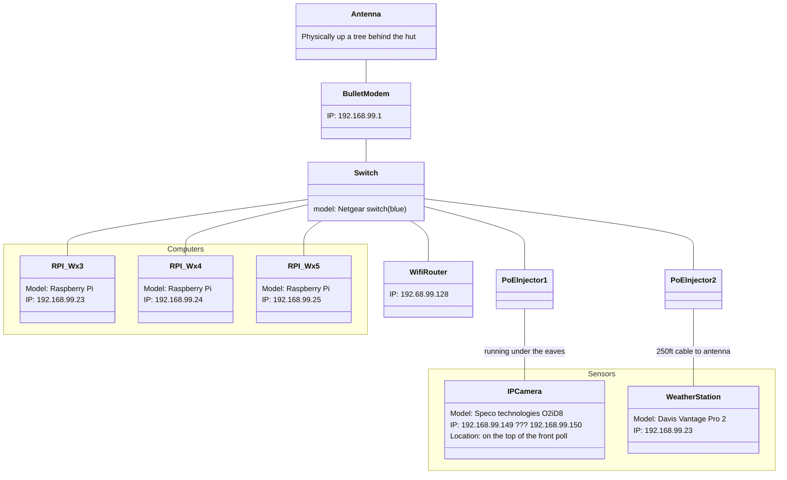

# ACCVI Hišimy̓awiƛ Hut
This repository is for managing the software for the weather station and camera, controlled from a raspberryPi in [the ACCVI Hut on 5040 Peak](https://accvi.ca/5040-peak-hut/).

## System Design/Intent
The system is designed to be as simple as possible, and to be as resilient as possible to power outages and network outages.

All Data from the weather station and camera is cached on the pi, stored in this repository's `./data` directory.
This directory is specially mounted as a ramfs filesystem, so that it is stored in memory, and not on the SD card.
- UPSIDE: the SD card doesn't burn out.
- DOWNSIDE: data is lost on reboot, and is not backed up.
The cron job scripts in their respective directories are responsible for backing up the data, and flushing it from their respective directories.

## System Diagram

## Weather Station
the weather station script (`./weather_station/cron.sh`) is responsible for:
- getting the data
- backing up the data up
- and flushing it from the `./data/weather_station` directory.

### Backup Locations:
#### victoriaweather.ca

#### wunderground.com
[station here](https://www.wunderground.com/dashboard/pws/IUCLUE4)

#### S3 5040.oram.ca

## Webcam
the webcam script (`./webcam/cron.sh`) is responsible for:
- getting the data
- backing up the data up
- and flushing it from the `./data/webcam` directory.

### Backup Locations:
#### Windy
once the hut is setup, with a consistent image url for the latest, we can register it here:
https://www.windy.com/-Add-new-webcam/webcams/add?48.477,-123.531,5
#### S3 5040.oram.ca
